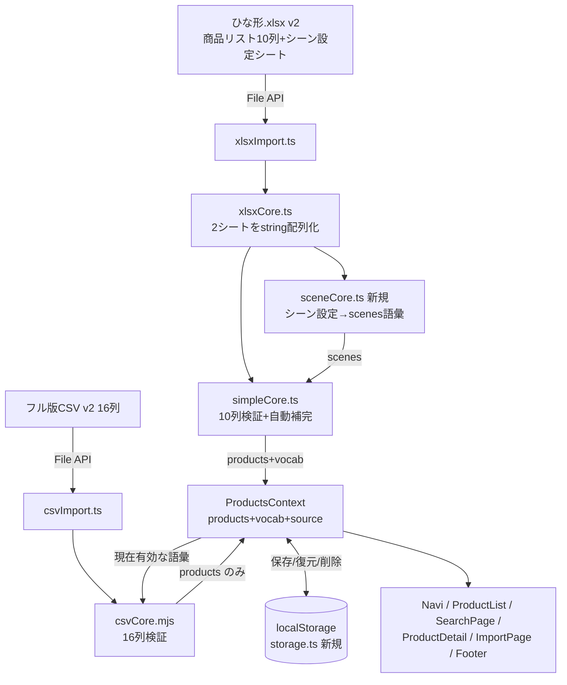

# 福祉用具カタログアプリ 設計書 v2(知人配布版)

**作成日**: 2026-08-19
**ステータス**: 確定(実装未着手)
**元要件**: `docs/requirements.md`(要件定義書 v2・知人配布版、2026-08-19確定。本書の唯一の要件の正)
**注記**: 本書は v2(知人配布版)。旧版(案件版v1・かんたん版)は git 履歴を参照。旧設計の実装(CSV取り込み・Excel取り込み・画面構成・マッチング・PWA)は本リポジトリに完了・公開済みであり、本書は**その上に行う改訂分**を定義する。変更に言及しないファイル・機能は現状のまま維持する。

---

## 0. 設計方針: 下位モデル(Sonnet級)での実装効率を最優先

実装は下位モデルへの委任を想定するため、以下の原則で設計する。

1. **判断余地を残さない**: 列構成・関数シグネチャ・エラーメッセージ文言・localStorageキー名とJSONスキーマ・類似商品スコア規則・検証規則を本書に確定値で明記する。実装者は転記と結線のみ行う
2. **新規作成より流用・改修**: 既存の `csvCore.mjs` / `simpleCore.ts` / `xlsxCore.ts` / `xlsxImport.ts` / `csvImport.ts` / `ProductsContext.tsx` は実装済み・検証済み。本書の指示は「新しく書く」のではなく既存実装への**差分改修**として書く(指示のない箇所のロジック改変を禁止)
3. **1タスク=1コミット**: 各タスク完了時に `npm run build`・`npm test`・`npm audit`(0件)が通る状態を維持する
4. **タスクごとに検証コマンドと推奨モデルを明記**(§10)

---

## 1. 概要

### 1-1. 目的

本アプリを「知人がまず個人的に使ってみる、配布用のベースアプリ」へ位置づけ直す。今のリポジトリ・公開ページ(https://mamoto777.github.io/fukushi-catalog-csv-trial/)をそのまま改訂し、URLを渡すだけで配布完了とする。実データ(商品・価格)は端末のブラウザ内にのみ存在し、リポジトリ・公開ページ・外部サーバーには一切載せない原則を維持する。

### 1-2. スコープ(要件FR-1〜FR-9)

| # | 機能 | 概要 |
|---|---|---|
| FR-1 | かんたん版Excelひな形 v2(10列) | メーカー・TAISコード・仕様列を追加 |
| FR-2 | シーン語彙の入れ替え | ひな形に表示状態の「シーン設定」シートを追加し、読み込み時に語彙を再構築 |
| FR-3 | フル版CSV v2(16列) | `taisCode` 列を `maker` 直後に挿入 |
| FR-4 | 端末内保存(localStorage) | 取り込みデータを保存し次回起動時に自動復元 |
| FR-5 | 語彙の状態管理 | 「現在有効な語彙」を1つ持ち、ナビ・絞り込み・自動導出が追随 |
| FR-6 | 商品名キーワード検索 | 新設 `/search`。name/maker/taisCode の部分一致 |
| FR-7 | 分類内のシーン絞り込み | ジャンル内リストに「場面」フィルタを追加 |
| FR-8 | 商品詳細の拡充 | TAISコード表示行+類似商品(自動・上位3件) |
| FR-9 | 配布向け文言・ドキュメント改訂 | 個人利用者向け文言へ統一、手順書等の改訂 |

### 1-3. スコープ外(要件§5。実装しない)

分類(9ジャンル)・「誰が使う」語彙の編集 / ジャンル画像差し替え / 検索の全角半角・かなカナ正規化・あいまい検索 / 複数データセット管理(保存は常に最新1件) / 類似商品の手動指定 / .xls対応・v1ひな形(7列)・旧15列CSV互換 / guide.html のスクリーンショット再撮影 / リポジトリ名・URL変更 / サーバー・DB・ログイン・LLM。

---

## 2. アーキテクチャ

技術スタックは現状のまま: Vite 8 + React + TypeScript / react-router-dom(HashRouter) / 素のCSS / Vitest 4 / fflate / 手書きPWA。**追加npmパッケージなし**。

### 2-1. データフロー(v2)



### 2-2. レイヤーと依存関係

- **純ロジック層**(React非依存・ユニットテスト対象): `csvCore.mjs` / `simpleCore.ts` / `xlsxCore.ts` / `sceneCore.ts`(新規) / `search.ts`(新規) / `similar.ts`(新規) / `storage.ts`(新規、localStorageアクセスのみ副作用)
- **取り込み口**: `csvImport.ts` / `xlsxImport.ts`(File → 純ロジック層の合成)
- **状態層**: `ProductsContext.tsx`(products+vocab+source+fileName。localStorage連携)
- **画面層**: pages / components(状態層のhookのみ参照。純ロジック層を直接呼ぶのは ImportPage の取り込み口呼び出しと、ProductDetail の `similarProducts`、SearchPage の `searchProducts` のみ)

---

## 3. ディレクトリ構成(追加・変更分のみ)

```
fukushi-csv-import-案件版/
├─ docs/
│  ├─ design.md                       # 本設計書(v2で上書き)
│  └─ 依頼元向けキット/                # フォルダ名は変更しない(文中呼称のみ「利用者」系へ)
│     ├─ かんたん版記入手順書.md        # 改訂: 10列+シーン設定シート+保存仕様
│     └─ CSV記入手順書.md              # 改訂: 16列
├─ public/
│  ├─ products-template.csv           # 改訂: 16列版
│  ├─ products-template-simple.xlsx   # 再生成: 10列+シーン設定シート(生成物)
│  ├─ sw.js                           # 改訂: キャッシュ名 v4
│  └─ guide.html                      # 改訂: v2変更点のテキスト追記のみ
├─ scripts/
│  └─ make_simple_template.py         # 改訂: 10列+シーン設定シート生成
├─ src/
│  ├─ types.ts                        # 改訂: Product.taisCode?: string 追加
│  ├─ App.tsx                         # 改訂: /search ルート追加
│  ├─ logic/
│  │  ├─ csvCore.mjs                  # 改訂: 16列化(taisCode)
│  │  ├─ csvCore.d.mts                # 変更なし(シグネチャ不変)
│  │  ├─ simpleCore.ts                # 改訂: 10列検証+仕様パース
│  │  ├─ sceneCore.ts                 # 新規: シーン設定シート→scenes語彙
│  │  ├─ xlsxCore.ts                  # 改訂: 2シート読み(商品リスト+シーン設定)
│  │  ├─ xlsxImport.ts                # 改訂: 語彙合成+検証の直列化
│  │  ├─ csvImport.ts                 # 改訂: vocab引数化・ImportResult拡張
│  │  ├─ storage.ts                   # 新規: localStorage保存・復元・削除
│  │  ├─ search.ts                    # 新規: キーワード検索(純関数)
│  │  └─ similar.ts                   # 新規: 類似商品抽出(純関数)
│  ├─ data/
│  │  ├─ ProductsContext.tsx          # 改訂: vocab状態+localStorage連携
│  │  └─ questions.ts                 # 改訂: SCENE_OPTIONS静的参照の撤去
│  ├─ pages/
│  │  ├─ Home.tsx                     # 改訂: 検索ボタン追加+文言改訂
│  │  ├─ Navi.tsx                     # 改訂: 場面・困りごとを現在有効な語彙から取得
│  │  ├─ ProductList.tsx              # 改訂: 場面絞り込み追加
│  │  ├─ ProductDetail.tsx            # 改訂: TAIS行+類似商品節
│  │  ├─ SearchPage.tsx               # 新規: 商品名キーワード検索
│  │  └─ ImportPage.tsx               # 改訂: vocab受け渡し・保存失敗表示・文言改訂
│  ├─ components/
│  │  ├─ SortFilterBar.tsx            # 改訂: 「場面」select追加(オプション)
│  │  └─ DisclaimerFooter.tsx         # 改訂: custom時の文言(保存仕様に合わせる)
│  └─ styles.css                      # 改訂: 検索入力・類似商品節・保存警告の最小限の追加
├─ tests/
│  ├─ csvCore.test.ts                 # 改訂: 16列対応
│  ├─ simpleCore.test.ts              # 改訂: 10列対応
│  ├─ xlsxCore.test.ts                # 改訂: 2シート対応
│  ├─ sceneCore.test.ts               # 新規
│  ├─ storage.test.ts                 # 新規
│  ├─ search.test.ts                  # 新規
│  ├─ similar.test.ts                 # 新規
│  ├─ matching.test.ts                # 変更なし
│  └─ fixtures/
│     ├─ simple-ok.xlsx               # 再生成: 10列+シーン設定シート(生成物)
│     └─ simple-noscene.xlsx          # 新規: シーン設定シートなし(生成物)
├─ README.md                          # 改訂: v2変更点
└─ CLAUDE.md                          # 改訂: 設計書参照をv2へ
```

上記以外(matching.ts / format.ts / vocab.json / products.json / GenreList / ProductCard / EmptyState / BigButton / Header / BackButton / scripts/csv2json.mjs ほか)は**変更しない**。既存ファイルの削除もしない。

---

## 4. 型定義(追加・変更分)

### 4-1. `src/types.ts`

`Product` に1フィールド追加(それ以外は不変):

```typescript
export interface Product {
  // …既存フィールドはそのまま…
  taisCode?: string; // TAISコード(任意・自由記述。空文字または未定義=なし。デモ100商品は未定義)
}
```

`src/data/products.json`(デモ100商品)は**変更しない**(taisCode未定義のまま。表示側で非表示になる)。

### 4-2. `src/logic/csvImport.ts` の `ImportResult`(拡張)

```typescript
export type ImportResult =
  | {
      ok: true;
      products: Product[];
      count: number;
      encoding: "utf-8" | "shift_jis" | "xlsx";
      vocab: Vocab | null; // xlsx取り込み時=新しい語彙 / CSV取り込み時=null(現在の語彙を維持)
    }
  | { ok: false; errors: string[] };
```

`Vocab` 型は既存 `csvCore.d.mts` のものを流用する(変更なし)。

### 4-3. 新規モジュールのシグネチャ(この通りに実装する)

```typescript
// src/logic/sceneCore.ts
import type { Vocab } from "./csvCore.mjs";
export interface SceneBuildResult {
  scenes: Vocab["scenes"]; // エラー時は空配列
  errors: string[];
}
export const SCENE_SHEET_HEADER: readonly string[]; // ["場面", "困りごと"]
export function buildScenesFromRows(rows: string[][]): SceneBuildResult;

// src/logic/storage.ts
import type { Product } from "../types";
import type { Vocab } from "./csvCore.mjs";
export const STORAGE_KEY = "fukushi-catalog-data-v2";
export interface SavedData {
  version: 2;
  savedAt: string;   // ISO 8601(new Date().toISOString())
  fileName: string;
  products: Product[];
  vocab: Vocab;
}
export function parseSavedData(json: string | null): SavedData | null; // 純関数(テスト対象)
export function saveCustomData(data: Omit<SavedData, "version">): boolean; // 保存成功=true
export function loadCustomData(): SavedData | null;
export function clearCustomData(): void;

// src/logic/search.ts
import type { Product } from "../types";
export function searchProducts(products: Product[], query: string): Product[];

// src/logic/similar.ts
import type { Product } from "../types";
export function similarProducts(target: Product, products: Product[]): Product[]; // 上位3件
```

### 4-4. `src/data/ProductsContext.tsx` の `ProductsState`(拡張)

```typescript
export interface ProductsState {
  products: Product[];
  vocab: Vocab;                    // 現在有効な語彙(初期値=内蔵vocab.json)
  source: "demo" | "custom";
  fileName: string | null;
  /** 取り込み成功時に呼ぶ。vocab=nullなら現在の語彙を維持。戻り値=localStorage保存の成否 */
  loadCustom: (products: Product[], vocab: Vocab | null, fileName: string) => boolean;
  resetToDemo: () => void;         // 内蔵100商品+内蔵語彙に戻し、保存データも削除
}
```

### 4-5. `src/logic/xlsxCore.ts` の `XlsxParseResult`(変更)

```typescript
export type XlsxParseResult =
  | {
      ok: true;
      productRows: string[][];        // 商品リストシート。各行10列にパディング
      sceneRows: string[][] | null;   // シーン設定シート。各行2列にパディング。シート不在時=null
    }
  | { ok: false; error: string };
export function parseXlsxToRows(buf: ArrayBuffer): XlsxParseResult;
```

### 4-6. `src/components/SortFilterBar.tsx` の Props(拡張)

```typescript
interface Props {
  // …既存のsort/priceBand/insurance系はそのまま…
  /** 場面絞り込み。sceneOptions を渡したときだけ「場面」selectを表示する */
  sceneOptions?: string[];
  scene?: string;                     // "all" またはシーンlabel
  onSceneChange?: (v: string) => void;
}
```

---

## 5. 機能仕様

### 5-1. FR-3: フル版CSVの16列化(`csvCore.mjs` 改修)

- `HEADER` 配列の `"maker"` の直後に `"taisCode"` を挿入する(16列)。それ以外の検証ロジックは**一切変更しない**
- `taisCode` の扱い: **任意**。`rec.taisCode`(trim済み)をそのまま `products.push` に `taisCode: rec.taisCode` として追加する。空文字可・形式チェックなし・必須列リストに**加えない**
- 旧15列ヘッダは既存の「ヘッダ行が想定と一致しません。想定: … / 実際: …」エラーで自然に弾かれる(専用の互換処理を書かない)
- `csvCore.d.mts` はシグネチャ不変のため変更しない
- `scripts/csv2json.mjs` は共通コアを呼ぶだけなので**変更しない**(入力 `data/products.csv` が16列になるだけ)
- `public/products-template.csv` を16列に更新: ヘッダを `id,name,maker,taisCode,genre,price,insurance,summary,description,specs,recommendFor,caution,concernTags,sceneTags,userTags,popularity` とし、既存サンプル3行の `maker` 直後に taisCode 値を挿入する。**p001行=`01234-000001`(架空)、p002・p003行=空文字**。他の列の値は現状のまま

### 5-2. FR-1: かんたん版ひな形 v2(10列)の検証(`simpleCore.ts` 改修)

`SIMPLE_HEADER` をこの10見出し・この順で置き換える:

```
商品名, メーカー, 分類, 価格(円), TAISコード, ひとこと説明, 仕様, 困りごと1, 困りごと2, 誰が使う
```

- 行の切り詰め/パディングは 7→**10列**に変更。全10列空(trim後)の行はスキップ(v1と同じ。行番号はExcelのまま詰めない)
- **見出し不一致エラーの文言を変更**(v1ひな形の案内を兼ねる):
  `1行目: ひな形が古い形式か、見出しが変更されています。アプリから新しいひな形(Excel)をダウンロードしてお使いください`
- 列ごとの検証(エラー文言は§7の一覧で確定。v1から不変の項目はロジック・文言とも変更しない):

| 列 | 必須 | 検証 |
|---|---|---|
| A 商品名 | 必須 | 空→エラー(v1と同じ) |
| B メーカー | 任意 | 検証なし |
| C 分類 | 必須 | 9ジャンル日本語名(v1と同じ) |
| D 価格(円) | 必須 | 正の整数(v1と同じ) |
| E TAISコード | 任意 | 検証なし(trimのみ) |
| F ひとこと説明 | 必須 | 空→エラー(v1と同じ) |
| G 仕様 | 任意 | 下記の仕様パース |
| H 困りごと1 | 必須 | **引数vocabのscenes由来の困りごと集合**に対して検証(v1と同じロジック。語彙の出どころが変わるだけ) |
| I 困りごと2 | 任意 | 同上 |
| J 誰が使う | 必須 | 3択(v1と同じ) |

**仕様(G列)のパース規則**(新規ヘルパー関数 `parseSpecsCell` として実装):

1. セル値を `/\r?\n/` で行分割し、各行をtrimする。空行は無視
2. 半角 `:` と全角 `：` の**先に現れる方**の位置 `sep` で分割する(`indexOf` を両方取り、-1でない方の小さい方)
3. `sep` が存在しない、または `sep === 0`(項目名が空)の行はエラー: `N行目: 仕様 "◯◯" は「項目名:値」形式ではありません`(◯◯=trim済みの行文字列)。エラー行はspecsに加えず次の行へ続行
4. 結果: `specs[前半trim] = 後半trim`。有効行0件なら `{}`

**Productへの自動補完**(v1からの変更点のみ。表にない項目はv1仕様・実装を踏襲):

| フィールド | v2の値 |
|---|---|
| `maker` | B列trim。空なら `"―"` |
| `taisCode` | E列trim(空文字のまま格納してよい) |
| `specs` | G列のパース結果(空なら `{}`) |

id自動採番(`p001`〜)・`insurance: "rental"` 固定・`popularity: 3` 固定・`description`=ひとこと説明と同文・`recommendFor` 生成・`concernTags`/`sceneTags` 導出・`userTags` 展開は**既存コードのまま**。ただし sceneTags 導出の逆引き元は引数 `vocab.scenes`(=シーン設定シート由来)になる(コード変更は不要。渡すvocabが変わるだけ)。

`validateSimpleRows(rows, vocab)` のシグネチャは不変。

### 5-3. FR-2: シーン設定シートの解釈(`sceneCore.ts` 新規)

`buildScenesFromRows(rows)` の仕様(rowsはシーン設定シートの2列化済みstring[][]。rows[0]が1行目):

1. **見出し検証**: `rows[0]` の2列(trim後)が `["場面", "困りごと"]` と完全一致しない場合、エラー1件で即return:
   `シーン設定シート 1行目: 見出しが「場面」「困りごと」ではありません。アプリから新しいひな形(Excel)をダウンロードしてお使いください`
2. 2行目以降を順に処理(N=Excel行番号=添字+1)。場面・困りごとともtrimする:
   - 両方空 → スキップ
   - 場面が空・困りごとのみ → エラー `シーン設定シート N行目: 場面 が空です`
   - 困りごとが空・場面のみ → エラー `シーン設定シート N行目: 困りごと が空です`
   - 困りごとが既出(全場面を通じて) → エラー `シーン設定シート N行目: 困りごと "◯◯" が重複しています(困りごとは全体で1つずつにしてください)`
   - 有効行 → `Map<場面label, string[]>`(挿入順維持)に追記。**場面の並び順=初出順、困りごとの並び順=行順**
3. 全行処理後:
   - 有効行0件 → エラー `シーン設定シートに場面と困りごとが1件もありません(2行目以降に記入してください)`
   - 場面が12種を超える → エラー `シーン設定シート: 場面は12種類までにしてください(現在◯種類)`
   - 有効行(=困りごと)が120行を超える → エラー `シーン設定シート: 困りごとは120行までにしてください(現在◯行)`
4. エラーが1件以上あれば `{ scenes: [], errors }`。なければ `{ scenes: Mapから組み立てた {label, concerns}[], errors: [] }`

行ごとのエラーは全件収集する(1件目で打ち切らない。既存 `simpleCore` と同じ流儀)。

### 5-4. `xlsxCore.ts` の2シート対応(改修)

既存実装からの変更点のみ(それ以外のzip展開・XML解釈・共有文字列・rPh除外・セル参照解決のロジックは**変更しない**):

1. **シート特定の変更**(`findVisibleSheetTarget` を置き換え): workbook.xml の `sheet` 要素を文書順に走査し、
   - **商品リストシート** = `state` 属性が無いか `"visible"`、かつ `name` 属性が `"シーン設定"` でない**最初の**シート。見つからない/Target解決不可 → 既存の `FORMAT_ERROR`
   - **シーン設定シート** = `name` 属性が `"シーン設定"` と完全一致する最初のシート(表示状態は不問)。見つからなければ `sceneRows: null` で成功を返す(エラーにするのは xlsxImport 側)。見つかったがTarget解決不可/ファイル欠落 → `FORMAT_ERROR`
   - rels 経由のTarget解決ロジックは既存の関数を流用する
2. **`parseSheetToRows` の汎用化**: 引数に `colCount: number` と `maxDataRows: number` を追加し、パディング列数と行上限をシートごとに変える:
   - 商品リスト: `colCount=10`・`maxDataRows=1000`。行超過エラー文言は既存の `商品データは1,000行までにしてください`
   - シーン設定: `colCount=2`・`maxDataRows=1000`。行超過エラー文言は `シーン設定シートは1,000行までにしてください`
   - 行超過の判定方法(非空セルを含む最大行番号 > maxDataRows+1)は既存のまま
3. 返り値を §4-5 の形に変更する

`FORMAT_ERROR`・zip爆弾対策(filter+30MB上限)・`ROW_LIMIT_ERROR` の仕組みは現状維持。

### 5-5. `xlsxImport.ts` の直列化(改修)

処理手順(この順で実装。エラーは各段階で打ち切り、後段の検証をしない):

1. サイズ検査: 既存のまま(10MB超 → `ファイルが大きすぎます(上限10MB)`)
2. `parseXlsxToRows(buf)` → `ok: false` なら `{ ok: false, errors: [error] }`
3. `sceneRows === null` なら `{ ok: false, errors: ["シーン設定シートが見つかりません。ひな形が古い形式の可能性があります。アプリから新しいひな形(Excel)をダウンロードしてお使いください"] }`
4. `buildScenesFromRows(sceneRows)` → errors非空なら `{ ok: false, errors }`
5. 語彙を合成する: `const vocab: Vocab = { users: vocabJson.users, genres: vocabJson.genres, scenes }`(users/genresは**内蔵固定**。scenesのみシート由来)
6. `validateSimpleRows(productRows, vocab)` → errors非空なら `{ ok: false, errors }`
7. 成功: `{ ok: true, products, count: products.length, encoding: "xlsx", vocab }`

### 5-6. FR-5: `csvImport.ts` の語彙引数化(改修)

- シグネチャを `importCsvFile(file: File, vocab: Vocab): Promise<ImportResult>` に変更し、内部の `vocabJson` 静的importを**削除**して引数を使う(タグ検証が「現在有効な語彙」に対して行われるようにする)
- 成功時の返り値に `vocab: null` を追加する(CSV取り込みは商品のみ置き換え)
- それ以外(文字コード判定・行数上限・エラー文言)は変更しない

### 5-7. FR-4/FR-5: 状態管理と保存(`storage.ts` 新規+`ProductsContext.tsx` 改修)

**`storage.ts`**:

- `STORAGE_KEY = "fukushi-catalog-data-v2"`(この文字列で固定)
- `parseSavedData(json)`: 純関数。次を**すべて**満たさなければ `null`(黙って無視):
  1. `json` が非null文字列で `JSON.parse` が例外を投げない
  2. パース結果がオブジェクトで `version === 2`
  3. `fileName` がstring、`savedAt` がstring
  4. `products` が配列で `length >= 1`、全要素がオブジェクトで `id`・`name` がstring
  5. `vocab` がオブジェクトで `users`・`genres`・`scenes` がいずれも配列
- `saveCustomData(data)`: `localStorage.setItem(STORAGE_KEY, JSON.stringify({ version: 2, ...data }))` を try/catch で包み、例外(容量超過等)・`typeof localStorage === "undefined"` なら `false`、成功なら `true`
- `loadCustomData()`: `typeof localStorage === "undefined"` なら `null`。`parseSavedData(localStorage.getItem(STORAGE_KEY))` を返す。**不正データは削除せず無視のみ**(次回の保存成功時に上書きされる)
- `clearCustomData()`: `localStorage.removeItem(STORAGE_KEY)`(try/catchで包み、例外は握りつぶす)

**`ProductsContext.tsx`**(v1実装からの改修):

- 内部状態を1つのオブジェクトに統合し、**lazy initializer** で復元する:

```typescript
interface InternalState {
  products: Product[];
  vocab: Vocab;
  source: "demo" | "custom";
  fileName: string | null;
}
const DEMO_STATE: InternalState = {
  products: DEMO_PRODUCTS,
  vocab: vocabJson as Vocab,
  source: "demo",
  fileName: null,
};
const [state, setState] = useState<InternalState>(() => {
  const saved = loadCustomData();
  if (saved) {
    return { products: saved.products, vocab: saved.vocab, source: "custom", fileName: saved.fileName };
  }
  return DEMO_STATE;
});
```

- `loadCustom(products, vocab, fileName)`: `nextVocab = vocab ?? state.vocab` として state を `{ products, vocab: nextVocab, source: "custom", fileName }` に置き換え、`saveCustomData({ savedAt: new Date().toISOString(), fileName, products, vocab: nextVocab })` の戻り値(boolean)をそのまま返す
- `resetToDemo()`: `DEMO_STATE` に戻し、`clearCustomData()` を呼ぶ
- 「v1では保存禁止」だった設計はv2要件で撤回された。localStorage以外(sessionStorage/Cookie/外部送信)への書き込みは引き続き禁止

**`questions.ts` / `Navi.tsx`**(語彙の追随):

- `questions.ts`: `SCENE_OPTIONS` のexportを削除し、`concernsForScene` を純関数化する:
  `export function concernsForScene(scenes: SceneOption[], scene: string): string[]`(第1引数に語彙を受け取る)。`USER_OPTIONS`・`GENRE_OPTIONS`・`genreLabel`・`MAX_CONCERNS`・`SceneOption` 型は現状のまま(users/genresは固定語彙のため)
- `Navi.tsx`: `const { vocab } = useProducts();` を追加し、質問2の選択肢を `vocab.scenes`、質問3を `concernsForScene(vocab.scenes, scene)` に変更する。それ以外のUI・遷移は変更しない
- `SCENE_OPTIONS` の参照箇所は Navi.tsx のみ(grep確認済み)。他画面への影響なし

### 5-8. FR-6: 商品名キーワード検索(`search.ts`+`SearchPage.tsx` 新規)

**`searchProducts(products, query)`**:

1. `q = query.trim().toLowerCase()`。`q === ""` なら `[]` を返す
2. `products.filter((p) => [p.name, p.maker, p.taisCode ?? ""].some((f) => f.toLowerCase().includes(q)))`
3. 並び順は入力配列の順のまま(並べ替えしない)。正規化は前後空白除去+英字大小無視のみ(全角半角・かなカナ変換はしない)

**`SearchPage.tsx`**(ルート `/search`):

1. Header `商品名からさがす` + BackButton(既存コンポーネント流用)
2. `<input type="search">`(`placeholder="商品名・メーカー・TAISコード"`、`aria-label` 同文)。入力のたび(`onChange`)に即時絞り込み(stateに保持し `searchProducts(useProducts().products, query)` を `useMemo` で計算)
3. 表示分岐:
   - `query.trim() === ""` → 案内文 `商品名・メーカー名・TAISコードの一部を入力してください`
   - 結果0件 → 既存 `EmptyState`(onBroaden/onResetFiltersは渡さない)
   - 結果あり → `{件数}件` 表示+既存 `ProductCard` のリスト(`<ul className="product-list">`。scoreは渡さない)
4. `App.tsx` に `<Route path="/search" element={<SearchPage />} />` を追加
5. `Home.tsx` にボタン追加(§5-11の文言表参照)。並び順: 困りごとから探す → ジャンルから探す → **商品名からさがす** → 商品データを読み込む

### 5-9. FR-7: 分類内のシーン絞り込み(`SortFilterBar.tsx`+`ProductList.tsx` 改修)

- `SortFilterBar` に §4-6 のオプションPropsを追加し、`sceneOptions` が渡されたときだけ既存のselect群の**先頭**に「場面」selectを描画する(選択肢=`<option value="all">すべて</option>`+各場面label)。渡されなければ従来と同一の描画
- `ProductList` に `const [scene, setScene] = useState<string>("all")` を追加し、**ジャンル起点(`!fromNavi`)のときのみ** `sceneOptions={vocab.scenes.map((s) => s.label)}` 等を渡す。フィルタ処理は既存の `items` useMemoに `scene === "all" || s.product.sceneTags.includes(scene)` の条件を追加する(価格帯・保険区分と組み合わせ可能)
- ナビ起点リストには表示しない(ナビの回答自体が場面を含み、二重の場面条件は矛盾した0件を作るため。要件FR-7の対象は「ジャンル内リスト」)
- `hasFilter`(絞り込みリセット判定)に `scene !== "all"` を加え、リセット時に `setScene("all")` も行う

### 5-10. FR-8: 商品詳細の拡充(`similar.ts` 新規+`ProductDetail.tsx` 改修)

**`similarProducts(target, products)`**(決定論。この規則で固定):

1. 候補 = `products` のうち `p.id !== target.id` かつ `p.genre === target.genre` かつ共通する `concernTags` が1つ以上
2. スコア = 共通する concernTags の数(`target.concernTags` との積集合サイズ)
3. 並び: スコア降順 → `popularity` 降順 → `id` 昇順(`a.id.localeCompare(b.id)`。`matching.ts` と同じ流儀)
4. 上位**3件**の `Product[]` を返す(0〜3件)

**`ProductDetail.tsx`**:

- **TAISコード行**: maker表示(`<p className="product-detail__maker">`)の直後に、`product.taisCode` が非空文字列のときのみ `<p className="product-detail__tais">TAISコード: {product.taisCode}</p>` を描画する(空・未定義なら行ごと非表示。デモ100商品では表示されない)
- **類似商品節**: 「注意点」節の後(詳細画面下部)に追加。`const similar = similarProducts(product, products)`(productsは `useProducts()` から)。`similar.length === 0` なら節ごと非描画。あれば:

```tsx
<section aria-labelledby="detail-similar">
  <h3 id="detail-similar">似ている商品</h3>
  <ul className="product-list">
    {similar.map((p) => <ProductCard key={p.id} product={p} />)}
  </ul>
</section>
```

既存 `ProductCard` のLinkで当該商品の詳細へ遷移する(追加実装不要。`useParams` の `id` 変化で再描画される)。

### 5-11. FR-9: アプリ内文言の改訂(この表で確定)

| 箇所 | 現行 | v2 |
|---|---|---|
| Home 取り込みボタン(main) | 自社データで試す | 商品データを読み込む |
| Home 取り込みボタン(sub) | 自社のCSVを読み込んでテストプレイ | 自分の商品リスト(Excel/CSV)に入れ替える |
| Home 検索ボタン(main) | (新規) | 商品名からさがす |
| Home 検索ボタン(sub) | (新規) | 商品名・メーカー・TAISコードで検索 |
| ImportPage Headerタイトル | 自社データで試す | 商品データを読み込む |
| ImportPage 説明文 | ひな形に商品データを記入し、このページで読み込むと、自社商品でテストプレイができます。/ 読み込んだデータはこの端末のブラウザ内だけで使われ、どこにも送信・保存されません。 | ひな形に商品データを記入し、このページで読み込むと、アプリの商品が自分のデータに入れ替わります。/ 読み込んだデータは**この端末のブラウザ内だけに保存**され、外部には一切送信されません。「デモデータに戻す」でいつでも消せます。 |
| ImportPage 保存失敗時(新規・成功表示の直下に警告様式で) | (新規) | 端末への保存はできませんでした(次回開くと消えます) |
| DisclaimerFooter(custom時) | 読み込みデータ表示中(この端末のみ) — リロードするとデモデータに戻ります | 読み込みデータ表示中(この端末内だけに保存・外部送信なし) |
| DisclaimerFooter(demo時) | (現行のまま) | 変更なし |

ImportPage の実装補足: 成功stateを `{ status: "success"; count: number; saved: boolean }` に拡張し、`saved = loadCustom(result.products, result.vocab, file.name)` の戻り値を入れる。`saved === false` のとき上表の警告を `<p className="import-save-warning">` で表示する。CSV/xlsx/.xlsの拡張子分岐は既存のまま(`.xls` エラー文言も不変)。`importCsvFile` 呼び出しは `importCsvFile(file, vocab)`(vocabは `useProducts()` から)。

### 5-12. FR-1/FR-2: ひな形生成スクリプト v2(`make_simple_template.py` 改訂)

既存スクリプトからの変更点(生成方法・照合ログの仕組みは踏襲):

**シート構成**(この順):

| シート名 | 状態 | 内容 |
|---|---|---|
| `商品リスト` | 表示(先頭) | 10列。1行目=見出し(太字+塗り)、2〜4行目=サンプル、A2でウィンドウ枠固定 |
| `シーン設定` | **表示** | A1=`場面`・B1=`困りごと`(太字+塗り)。2行目以降に内蔵vocab.jsonの全31行を機械転記(場面labelを困りごとごとに繰り返す。scenes順×concerns順) |
| `選択肢` | 非表示(hidden) | A列=分類(A1見出し+A2:A10の9語)、B列=誰が使う(B1見出し+B2:B4の3語)。**困りごと列は置かない**(シーン設定シート参照に変更のため) |

**商品リストシートの10列見出し**: §5-2 の `SIMPLE_HEADER` と同一文字列。

**列幅**: A=28, B=16, C=16, D=12, E=16, F=44, G=30, H=24, I=24, J=14。シーン設定シートは A=16, B=28。

**サンプル3行**(2〜4行目。仕様セルは値に `"\n"` を含める。G列の2〜4行目に `Alignment(wrap_text=True)` を設定):

| 商品名 | メーカー | 分類 | 価格(円) | TAISコード | ひとこと説明 | 仕様 | 困りごと1 | 困りごと2 | 誰が使う |
|---|---|---|---|---|---|---|---|---|---|
| らくあゆみステッキ軽量型 | あおぞら福祉機器 | 歩行補助 | 1200 | 01234-000001 | 軽くてにぎりやすい定番の一本杖 | 重さ:290g\n高さ調節:71〜94cm(10段階) | ふらつく・転びやすい | 屋外の外出が不安 | 本人が使う |
| ささえ四点杖ワイド | (空) | 歩行補助 | 1800 | (空) | 自立するから立ち上がり時も支えになる四点杖 | 重さ:640g\n高さ調節:66〜89cm | ふらつく・転びやすい | 支えがないと立てない | 本人が使う |
| みまもりセンサーライト | みらいケア | 見守り・生活サポート | 2000 | (空) | 夜中の動きをやさしく知らせる見守りセンサー | (空) | 夜中に動き回る | 一人にするのが心配 | どちらも |

(2行目のメーカー空=「―」補完の記入例、3行目の仕様空=任意の記入例を兼ねる)

**データ入力規則**(`DataValidation`、`type="list"`・`allow_blank=True`・`showErrorMessage=True`):

- C2:C1001(分類) → `formula1="'選択肢'!$A$2:$A$10"`
- H2:H1001 と I2:I1001(困りごと) → `formula1="'シーン設定'!$B$2:$B$121"`(**120行分の余裕**。利用者がシーン設定シートに追記した語もプルダウンに現れる)
- J2:J1001(誰が使う) → `formula1="'選択肢'!$B$2:$B$4"`

**照合ログ**: ジャンル9件・困りごと31件・誰が使う3件・シーン設定転記31行 を出力する。

**出力**:

- 通常実行: `public/products-template-simple.xlsx`
- `--fixtures` 実行: `tests/fixtures/simple-ok.xlsx`(商品リスト10列見出し+サンプル3行、シーン設定シート見出し+31行。入力規則なし)と `tests/fixtures/simple-noscene.xlsx`(商品リストシートのみ。シーン設定シートなし)の**2ファイル**を生成する

### 5-13. PWA(`sw.js` 改修)

- `CACHE_NAME` を `"fukushi-navi-v4"` に更新する
- `SHELL` 配列は現状のまま(両ひな形とも登録済み。追加ファイルなし)

### 5-14. FR-9: ドキュメント改訂

いずれも非エンジニアの個人利用者向けの平易な日本語。「依頼元」呼称は本文中で「利用者」「お使いになる方」系へ統一する(**フォルダ名 `docs/依頼元向けキット/` は変更しない**。既存ファイル削除・リネーム禁止の制約と参照切れ防止のため。呼称統一は文中のみ)。

1. **かんたん版記入手順書.md**(改訂): 10列の意味(メーカー・TAIS・仕様は任意/仕様は「項目名:値」を1行1項目・セル内改行で複数)・シーン設定シートの編集手順(場面と困りごとの行を追加すればナビとプルダウンに反映される。困りごとは全体で1つずつ)・保存仕様(読み込むと端末内に保存され次回も残る。「デモデータに戻す」で消える)・エラーの読み方
2. **CSV記入手順書.md**(改訂): 16列構成(taisCodeはmakerの直後・任意)へ更新
3. **README.md**(改訂): v2の変更点(10列ひな形・シーン語彙入れ替え・端末内保存・検索・場面絞り込み・類似商品・TAIS)をテキストで反映。位置づけを「配布用ベースアプリ」に改める
4. **public/guide.html**(改訂): 取り込み説明部にv2変更点のテキスト追記のみ(スクリーンショット再撮影はスコープ外)
5. **CLAUDE.md**(改訂): 設計書参照を「`@docs/design.md`(v2・知人配布版が正。旧版はgit履歴)」に更新。`docs/design-かんたん版.md` への実装時Read指示を削除する
6. **docs/design-かんたん版.md**(注記追記のみ): 冒頭に「本書はv1(7列)時代の設計。v2以降は docs/design.md を正とする」の1行を追記(本文は変更しない)

---

## 6. データ設計

### 6-1. localStorage(唯一の永続データ)

- キー: `fukushi-catalog-data-v2`(1件のみ。複数データセット管理はスコープ外)
- 値(JSON文字列):

```json
{
  "version": 2,
  "savedAt": "2026-08-19T03:00:00.000Z",
  "fileName": "商品リストかんたん版.xlsx",
  "products": [ { "id": "p001", "name": "…", "taisCode": "…", "…": "…" } ],
  "vocab": { "users": ["…"], "genres": [{ "id": "…", "label": "…" }], "scenes": [{ "label": "…", "concerns": ["…"] }] }
}
```

- ライフサイクル: 取り込み成功→上書き保存 / アプリ起動→検証つき復元(§5-7の5条件) / 検証失敗・version不一致→黙って無視しデモ起動(削除しない) / デモに戻す→削除 / 保存失敗→取り込み自体は成功継続+警告表示
- localStorageは端末内のみ。外部送信ゼロの原則は不変

### 6-2. 語彙(Vocab)の状態遷移

| イベント | products | vocab |
|---|---|---|
| 初回起動(保存なし) | 内蔵100商品 | 内蔵vocab.json |
| 起動(有効な保存あり) | 保存値 | 保存値 |
| かんたん版v2読み込み成功 | 置換 | **同時に置換**(scenesのみシート由来。users/genresは常に内蔵) |
| フル版CSV読み込み成功 | 置換 | 維持(検証は現在有効な語彙に対して実施) |
| デモに戻す | 内蔵へ | 内蔵へ(保存も削除) |

---

## 7. エラーハンドリング方針・メッセージ一覧

方針(全経路共通・既存踏襲): 検証エラーは行番号つきで**全件収集**して返し、エラーが1件でもあれば取り込みを行わない(部分取り込み禁止)。エラー時は既存データ(デモまたは前回取り込み分)を維持する。エラー文字列はReactテキストノードとしてのみ描画する。

**v2で新規・変更になるメッセージ**(この文言で固定。既存メッセージは変更しない):

| # | 発生箇所 | 文言 |
|---|---|---|
| 1 | simpleCore(見出し不一致=旧7列ひな形含む) | `1行目: ひな形が古い形式か、見出しが変更されています。アプリから新しいひな形(Excel)をダウンロードしてお使いください` |
| 2 | simpleCore(仕様の形式) | `N行目: 仕様 "◯◯" は「項目名:値」形式ではありません` |
| 3 | xlsxImport(シーン設定シート不在) | `シーン設定シートが見つかりません。ひな形が古い形式の可能性があります。アプリから新しいひな形(Excel)をダウンロードしてお使いください` |
| 4 | sceneCore(見出し) | `シーン設定シート 1行目: 見出しが「場面」「困りごと」ではありません。アプリから新しいひな形(Excel)をダウンロードしてお使いください` |
| 5 | sceneCore(場面空) | `シーン設定シート N行目: 場面 が空です` |
| 6 | sceneCore(困りごと空) | `シーン設定シート N行目: 困りごと が空です` |
| 7 | sceneCore(困りごと重複) | `シーン設定シート N行目: 困りごと "◯◯" が重複しています(困りごとは全体で1つずつにしてください)` |
| 8 | sceneCore(0件) | `シーン設定シートに場面と困りごとが1件もありません(2行目以降に記入してください)` |
| 9 | sceneCore(場面12種超) | `シーン設定シート: 場面は12種類までにしてください(現在◯種類)` |
| 10 | sceneCore(困りごと120行超) | `シーン設定シート: 困りごとは120行までにしてください(現在◯行)` |
| 11 | xlsxCore(シーン設定シート行超過) | `シーン設定シートは1,000行までにしてください` |
| 12 | ImportPage(保存失敗・エラーではなく警告) | `端末への保存はできませんでした(次回開くと消えます)` |

既存のまま維持するメッセージ(参考・変更禁止): ヘッダ不一致(フル版CSV)/ ファイルサイズ上限 / 文字コード判定不能 / 1,000行上限(商品) / Excel読み取り不能(FORMAT_ERROR)/ .xls非対応 / simpleCoreの各列エラー(商品名・分類・価格・ひとこと説明・困りごと・誰が使う)。

localStorage関連の例外(保存・削除時)はすべて try/catch で握りつぶし、アプリ動作を止めない(保存失敗のみ#12の警告で可視化する)。

---

## 8. セキュリティ要件

- **外部通信ゼロを維持**: fetch/XHR等の通信コードを書かない。localStorageは端末内のみで外部送信に該当しない
- **`.env` なし・APIキーなし・LLM不使用**(存在しないことが正)
- **XSS**: セル・CSV・localStorage由来の全文字列はReactテキストノード描画のみ。`dangerouslySetInnerHTML` 禁止(プロジェクトルール)
- **入力バリデーション**: 上限10MB・1,000行・zip爆弾対策(filter+展開後30MB)は既存仕様を維持。シーン設定シートにも行上限(§5-4)を設ける。localStorage復元データはスキーマ検証(§5-7)を通過したもののみ採用する
- **実在の商品・価格・取引先データをリポジトリに含めない**: fixtureとひな形サンプルは架空データのみ。TAISコードのサンプル値も架空(`01234-000001`)
- **追加パッケージなし**: `npm audit` 0件を維持
- コミット・pushは人間が実施(push前に `/pre-commit` 相当のチェック。リポジトリはPublicのため実データ混入なしを再確認)

---

## 9. テスト方針(Vitestユニット・観点一覧)

既存テスト(matching / csvCore / simpleCore / xlsxCore)は**回帰なしで全パス**を維持する(v2仕様変更に伴う期待値の更新はする。テストの削除はしない)。UI結線(Context復元・画面表示)はユニットテスト対象外とし、dev確認と人間チェックポイントで担保する。

| ファイル | 観点 |
|---|---|
| `tests/csvCore.test.ts`(改訂) | 16列ヘッダで正常パース(taisCode値が `Product.taisCode` に入る/空文字も通る)/ 旧15列ヘッダ→ヘッダ不一致エラー / 既存ケース(id形式・語彙外タグ・price不正・引用符・BOM等)を16列に更新して全維持 |
| `tests/sceneCore.test.ts`(新規) | 内蔵31行相当→7場面・順序保持(場面=初出順・困りごと=行順)/ 新場面追加が反映 / 見出し不一致 / 場面空・困りごと空・重複・0件 / 場面13種→#9エラー / 困りごと121行→#10エラー / 全空行スキップと行番号維持 / エラー全件収集 |
| `tests/simpleCore.test.ts`(改訂) | 10列サンプル3行→3件のProduct(maker空→`"―"`・maker記入値・taisCode trim・specs解釈結果・id連番・insurance rental・popularity 3・description同文)/ 仕様: 半角コロン・全角コロン・複数行・空行無視・形式エラー#2(エラー行以外は取り込まれないこと=全体エラー)/ 見出し不一致(旧7列)→#1 / 既存の各列エラー文言の維持 / シート由来の新語彙でsceneTags導出が変わること |
| `tests/xlsxCore.test.ts`(改訂) | `simple-ok.xlsx` → productRows(10列)とsceneRows(2列・31行+見出し)の完全一致 / `simple-noscene.xlsx` → `sceneRows: null` / 壊れたバイト列→FORMAT_ERROR(既存) |
| `tests/storage.test.ts`(新規) | `parseSavedData`: 正常JSON→復元 / null・壊れたJSON・version不一致・products空配列・vocab欠落→null / `STORAGE_KEY` の値固定 |
| `tests/search.test.ts`(新規) | name/maker/taisCode それぞれの部分一致 / 大文字小文字無視 / クエリ前後空白trim / 空クエリ→[] / taisCode未定義の商品でも落ちない / 入力順維持 |
| `tests/similar.test.ts`(新規) | 同ジャンル+共通困りごと1以上のみ抽出 / スコア=共通数 / スコア降順→popularity降順→id昇順 / 上位3件で打ち切り / 自分自身除外 / 0件 |
| `tests/matching.test.ts` | 変更なし(回帰確認のみ) |

検証コマンド: `npm test`(全パス)・`npm run build`(エラーなし)・`npm audit`(0件)。

---

## 10. タスク分解(1タスク=1コミット単位・依存順・推奨モデルつき)

実装は各タスクを番号順に行う(後のタスクは前のタスクの完了=build/test/audit通過を前提とする)。`git add` / `git commit` はしない(人間が `git status` 確認のうえ実施)。既存ファイルの削除はしない。

| # | タスク | 対象ファイル | 完了条件(検証コマンド) | 推奨モデル |
|---|---|---|---|---|
| 1 | **フル版16列化**: `Product.taisCode?` 追加(§4-1)・csvCore HEADER改訂と `taisCode` 転記(§5-1)・テンプレCSV16列化・テスト更新 | src/types.ts / src/logic/csvCore.mjs / public/products-template.csv / tests/csvCore.test.ts | `npm run build`・`npm test` 通過。`node scripts/csv2json.mjs` が従来どおり入力不在エラーを表示 | Sonnet 5 |
| 2 | **sceneCore新規**(§5-3)+テスト | src/logic/sceneCore.ts / tests/sceneCore.test.ts | `npm test` 全パス(新規ケース含む) | Sonnet 5 |
| 3 | **simpleCore v2**: 10列化・見出しエラー文言変更・`parseSpecsCell`・自動補完3点(§5-2)+テスト改訂 | src/logic/simpleCore.ts / tests/simpleCore.test.ts | `npm test` 全パス | Sonnet 5 |
| 4 | **ひな形生成スクリプトv2**(§5-12)改訂→実行してひな形と2fixtureを再生成 | scripts/make_simple_template.py / public/products-template-simple.xlsx / tests/fixtures/simple-ok.xlsx / tests/fixtures/simple-noscene.xlsx | `PYTHONUTF8=1 python scripts/make_simple_template.py`(+`--fixtures`)の照合ログ(9/31/3/31)一致。※Excelでのプルダウン目視確認は**人間チェックポイント①**として完了報告に記載(受入条件1) | Sonnet 5 |
| 5 | **xlsxCore v2**: 2シート特定・colCount/maxDataRows汎用化・返り値変更(§5-4)+テスト改訂 | src/logic/xlsxCore.ts / tests/xlsxCore.test.ts | `npm test` 全パス(simple-ok / simple-noscene 両fixture) | Sonnet 5 |
| 6 | **storage新規**(§5-7)+テスト | src/logic/storage.ts / tests/storage.test.ts | `npm test` 全パス | Sonnet 5 |
| 7 | **状態層v2**: ProductsContext(vocab状態・lazy復元・保存・削除)・questions.ts純関数化・Navi語彙追随・Footer文言(§5-7・§5-11) — ImportPageは一時的に `loadCustom(result.products, null, file.name)` で結線(戻り値未使用) | src/data/ProductsContext.tsx / src/data/questions.ts / src/pages/Navi.tsx / src/components/DisclaimerFooter.tsx / src/pages/ImportPage.tsx | `npm run build`・`npm test` 通過。`npm run dev` でナビ・全画面が従来どおり動作、取り込み→リロードで復元・「デモデータに戻す」で消えることを確認 | Sonnet 5 |
| 8 | **取り込み口v2**: ImportResult拡張(§4-2)・csvImport vocab引数化(§5-6)・xlsxImport直列化(§5-5)・ImportPage完全結線(vocab受け渡し・saved警告・文言改訂§5-11)・Home取り込みボタン文言 | src/logic/csvImport.ts / src/logic/xlsxImport.ts / src/pages/ImportPage.tsx / src/pages/Home.tsx / src/styles.css | `npm run build`・`npm test` 通過。devで: v2ひな形にシーン追記した.xlsx読み込み→ナビ質問2/3に新シーン反映・リロード復元。旧7列.xlsx/旧15列CSVが案内つきエラーで拒否されデータ維持 | Sonnet 5 |
| 9 | **検索**: search.ts+テスト・SearchPage・/searchルート・Home検索ボタン(§5-8) | src/logic/search.ts / tests/search.test.ts / src/pages/SearchPage.tsx / src/App.tsx / src/pages/Home.tsx / src/styles.css | `npm test` 全パス。devで #/search の即時絞り込み・0件表示・詳細遷移 | Sonnet 5 |
| 10 | **場面絞り込み**: SortFilterBarオプションProps・ProductListのscene state(§5-9) | src/components/SortFilterBar.tsx / src/pages/ProductList.tsx | `npm run build` 通過。devで: ジャンル内リストに「場面」selectが出て絞り込め、ナビ起点リストには出ない。価格帯・保険区分と併用可 | Sonnet 5 |
| 11 | **詳細拡充**: similar.ts+テスト・ProductDetailのTAIS行+類似商品節(§5-10) | src/logic/similar.ts / tests/similar.test.ts / src/pages/ProductDetail.tsx / src/styles.css | `npm test` 全パス。devで: デモ商品の詳細に「似ている商品」最大3件表示・タップ遷移。TAIS行はデモでは非表示、取り込みデータでは表示 | Sonnet 5 |
| 12 | **SWキャッシュ名v4**(§5-13) | public/sw.js | `npm run build` → `npm run preview` でひな形2種のダウンロードリンク動作 | Haiku 4.5 |
| 13 | **ドキュメント改訂**(§5-14): 手順書2点・README・guide.html・CLAUDE.md・design-かんたん版.md冒頭注記・「依頼元」呼称の文中統一 | docs/依頼元向けキット/*.md / README.md / public/guide.html / CLAUDE.md / docs/design-かんたん版.md | 記載内容が本設計と一致(列数・文言・保存仕様)。`grep` で本文中の「依頼元」残存が意図的な箇所(フォルダ名・履歴的記述)のみであること | Sonnet 5 |
| 14 | **最終検証**: `npm run build`・`npm test`・`npm audit` 0件・要件§6受入条件の機械確認分を総ざらいし、人間チェックポイントを列挙した完了報告を作成 | (変更なし) | 3コマンドすべて通過 | Haiku 4.5 |

**人間チェックポイント(パイプライン対象外。完了報告に依頼事項として列挙する)**:

- ① タスク4のひな形をExcelで開き、10列+シーン設定シート+プルダウン(分類・困りごと・誰が使う)を目視確認(受入条件1)
- ② スマホ実機で「ひな形記入→読み込み→再起動で復元→検索・絞り込み」(受入条件11)
- ③ `git status` 確認→コミット→push→GitHub Pages反映確認

---

## 11. 完了条件

要件定義書§6の受入条件1〜11と同一(再掲しない)。本設計との対応: 1→§5-12 / 2→§5-3・§5-5・§5-7 / 3→§5-7・§6-1 / 4→§5-8 / 5→§5-9 / 6→§5-10 / 7→§5-1・§5-2 / 8→§7 / 9→§9 / 10→§5-14 / 11→人間チェックポイント②。

---

## 12. 設計判断の記録(要件の範囲内での確定事項)

要確認事項に当たる曖昧さ・矛盾は検出しなかった。要件が実装方式を指定していない箇所は以下のとおり確定した(いずれも要件の記述から一意に導ける範囲の具体化):

1. **場面絞り込みはジャンル起点リストのみに表示**(§5-9): 要件FR-7の対象は「ProductList(ジャンル内リスト)」。ナビ起点リストは回答自体が場面条件を含むため、二重の場面フィルタは矛盾した0件を生みやすく表示しない
2. **商品リストシートの特定規則**(§5-4): 「最初の表示シートかつ名前が『シーン設定』でないもの」。シーン設定シートは名前完全一致で特定(利用者がシート順を入れ替えても壊れない)
3. **シーン設定シートにも見出し検証を追加**(§5-3): 見出し行をデータ行と取り違えるサイレント事故を防ぐため。要件の「不正入力は行番号つきエラーで拒否」の趣旨に沿う具体化
4. **語彙合成のusers/genresは常に内蔵値**(§5-5): 要件§1-3で分類・「誰が使う」は固定と確定済み。シート由来はscenesのみ
5. **破損した保存データは削除せず無視**(§5-7): 要件FR-4「黙って無視し、内蔵デモデータで起動」の文言どおり。次回の保存成功時に自然に上書きされる
6. **`docs/依頼元向けキット/` フォルダ名は不変**(§5-14): 「文書中の呼称」統一が要件であり、フォルダリネームは既存参照切れのリスクのみで益がない

---

## クロスチェック記録

> クロスチェック実施結果: 第1層(2026-08-19 実施)。新規の外部サービス・LLM API・npmパッケージの追加が**ゼロ**(localStorage・検索・類似抽出はすべてブラウザ標準+既存スタックで実現)。提案閾値に該当する差分なし。唯一の新規ブラウザAPIは `localStorage`(全ブラウザ標準)で依存追加なし。プライベートブラウジング等で書き込み例外が起きうる点は§5-7のtry/catch+保存失敗警告(§7-#12)で吸収済み。ナレッジVault検索: 端末内保存・部分一致検索に直接該当する新規資料なしと判断(本リポジトリの既往設計2件で同領域を調査済みのため再検索省略)。
